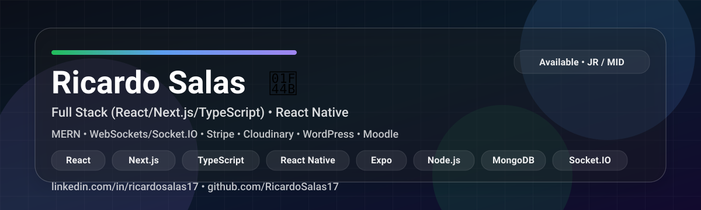

# Luis Ricardo Salas (Ricardo) 👋
**Full Stack Developer (React/Next.js/TypeScript) | React Native**

📍 Querétaro, México  
📩 **Email:** ricardosalas.1716@gmail.com · 💬 **WhatsApp:** https://wa.me/525539963312  
🔗 **LinkedIn:** https://linkedin.com/in/ricardosalas17  
💼 **Work GitHub:** https://github.com/RicardoSalasXeleva  
📄 **CV (PDF):** [Descargar](./Luis%20Ricardo%20Salas%20Montes%20de%20Oca_CV_ES.pdf)

---

## Sobre mí
Soy desarrollador **Full Stack** con enfoque en **Frontend**, con experiencia entregando productos web y mobile:

- UI desde **Figma** → implementación → integración de APIs → **deploy a producción**
- Trabajo con equipos/PM/clientes, demos de features y colaboración en PRs/code reviews
- Integraciones: **Stripe**, **Cloudinary**, **WebSockets/Socket.IO**, **OpenAI API**
- Experiencia en **WordPress** y **Moodle**

---

## Proyectos (selección)
- **Wingman:** editor de mapas/rutas tipo “paint” para pilotos (zoom/drag/preview/export)  
  https://www.wingmanpilotart.com/
- **RTSE:** perfil médico + consultas (IA) sobre medicamentos/efectos secundarios  
  https://rightsideeffects.com/
- **Oxprox:** dashboard para explorar proxy voting/ESG en base pública  
  https://webapp.oxprox.org/
- **Xeleva:** sitio corporativo  
  https://xeleva.com/

---

## Tech stack
**Frontend:** React, Next.js, Vite, TypeScript, Material UI, Tailwind  
**Mobile:** React Native, Expo, Xcode  
**Backend / Integraciones:** Node.js, Express, MongoDB, WebSockets/Socket.IO, Stripe, Cloudinary  
**CMS/LMS:** WordPress, Moodle  
**Tools:** Git, GitHub Actions (CI/CD), Figma

---

## En qué estoy enfocado
✅ Vacantes **Frontend React**, **React Native** y **Full Stack MERN** (JR/MID)  
🌎 **Inglés:** intermedio básico (reuniones y entendimiento de requerimientos; mejorando fluidez)

---

<!-- Banner / SVG (opcional, si lo tienes en el repo) -->

  

---

## 💻 Tech Stack (badges)

---

## 📊 GitHub Stats
 
 

---

